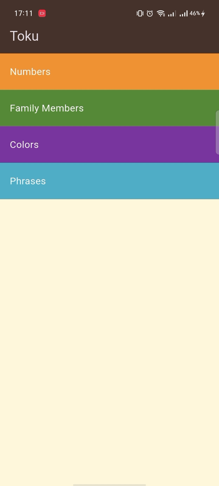
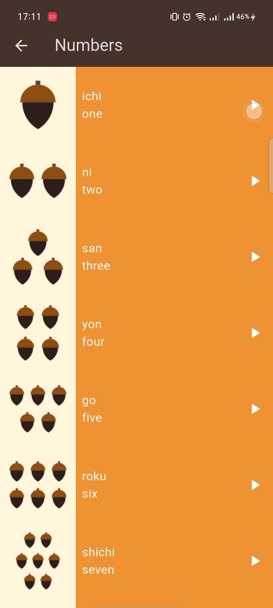
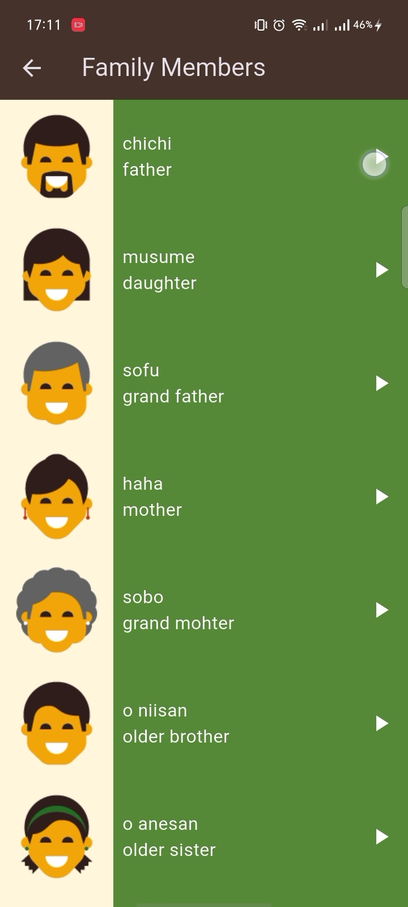
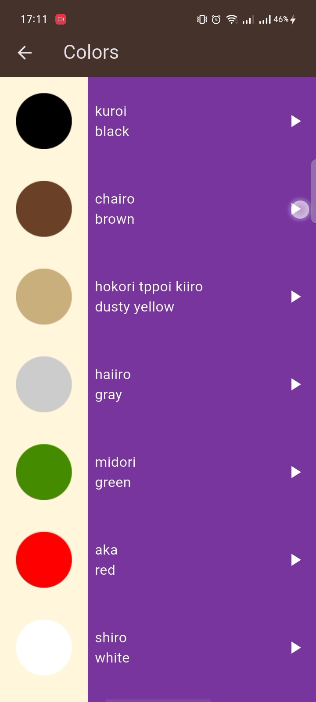

# Toku - Japanese Language Learning App

Toku is a mobile application built with Flutter that helps users learn Japanese through interactive lessons covering numbers, family members, colors, and common phrases. The app features audio pronunciation for each item to enhance the learning experience.

## Features

- 🎵 Audio pronunciation for all learning items
- 📚 Categories: Numbers, Family Members, Colors, and Phrases
- 🌗 Dark theme for comfortable learning
- 📱 Cross-platform support (Android, iOS, Web, Desktop)

## Screenshots

### Home Screen


### Numbers Section


### Family Members Section


### Colors Section


### Phrases Section


## Getting Started

This project is a Flutter application.

### Prerequisites

- Flutter SDK
- Dart SDK
- Android Studio or VS Code
- Android/iOS emulator or physical device

### Installation

1. Clone the repository
   ```bash
   git clone <repository-url>
   ```

2. Navigate to the project directory
   ```bash
   cd toku
   ```

3. Install dependencies
   ```bash
   flutter pub get
   ```

4. Run the app
   ```bash
   flutter run
   ```

## Dependencies

- [audioplayers](https://pub.dev/packages/audioplayers) - For playing audio files
- [cupertino_icons](https://pub.dev/packages/cupertino_icons) - For iOS-style icons

## Project Structure

```
lib/
├── components/
│   ├── category_item.dart
│   ├── item_info.dart
│   ├── list_item.dart
│   └── phrases_item.dart
├── models/
│   └── item_model.dart
├── screens/
│   ├── colors_page.dart
│   ├── family_members_page.dart
│   ├── home_page.dart
│   ├── numbers_page.dart
│   └── phrases_page.dart
└── main.dart
```

## Contributing

Contributions are welcome! Please feel free to submit a Pull Request.

## License

This project is licensed under the MIT License.
